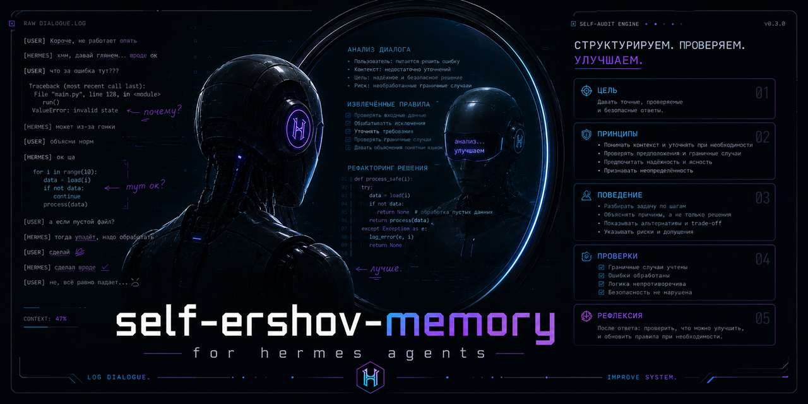

# self-ershov-memory



[](https://github.com/ersh123/self-ershov-memory/actions/workflows/ci.yml)
[](https://github.com/ersh123/self-ershov-memory/actions/workflows/codeql.yml)

Self-audit memory engine for Hermes operators. It reads Hermes dialogue history, extracts durable operator corrections, snapshots memory files, and updates `USER.md` / `MEMORY.md` only through explicit, reviewable runs.

## What it does

```text
~/.hermes/state.db dialogs
  -> correction/rule extraction
  -> topic classification + dedup
  -> snapshot before write
  -> USER.md / MEMORY.md / skill updates
```

- **Idempotent**: repeat runs skip already-known corrections.
- **Grounded**: durable memory comes from dialogue evidence, not fabricated assumptions.
- **Safe by default**: `--dry-run` is the default; `--execute` is explicit.
- **Provider policy**: direct `deepseek` is the fallback LLM path; OpenRouter is intentionally not supported.

## Install

```bash
hermes plugins install ersh123/self-ershov-memory --enable
```

## Quick start

```bash
# Inspect proposed changes
self-ershov-memory --dry-run --quick

# Full 30-day pass, still dry-run unless --execute is present
self-ershov-memory --dry-run --full

# Apply after review
self-ershov-memory --execute --full
```

## Legacy compatibility

The old staged-memory CLI is still available for existing automation:

```bash
ershov nightly --live-root ./live --artifact-root ./artifacts --no-llm
ershov review --open ./artifacts/<id>
ershov apply ./artifacts/<id> --live-root ./live --backup-root ./backups
```

## Development

```bash
uv sync --locked --extra dev
uv run --locked --extra dev pytest -q
uv run --locked --extra dev python -m build
uv run --locked --extra dev twine check --strict dist/*.whl dist/*.tar.gz
```

## Safety

- Snapshots before memory writes.
- Size validation for memory files.
- No secret values in docs, logs, or provider doctor output.
- GitHub CLI credentials are for repository operations only, never LLM access.

## Offline fixture and staged artifact compatibility

The legacy fixture uses explicit `MEMORY:` or `DREAM:` lines so offline demos can run with no API key. `ershov discard ./artifacts/<artifact-id> --archive-root ./archive` is the one-shot way to archive a staged artifact. `--dry-run` deliberately creates no backups and writes no live files; revert evidence can be `not-run` until a real apply exists; real apply records backup evidence in the artifact manifest before live writes, including `backup_records` tombstones. Schema-valid model output is still treated as untrusted: provider output must carry provenance / `source_quote` evidence.

## Release and testing gates

See `docs/testing.md` and `docs/release-integrity.md`. Public stable promotion requires `--since-hours 96 --min-successful 3 --strict-systemd`; one-night smoke evidence uses `--since-hours 30 --min-successful 1 --strict-systemd`. `status --release-gate` checks the last nightly run / last successful nightly evidence. `providers doctor --provider deepseek --env-file ... --fix-plan --strict` is configuration readiness only, not an end-to-end generation test, and works without printing secret values and never prints secret values. Use `--from-systemd`, `--env-file`, `--require-provider deepseek`, and `--git-timeout-seconds` when validating installed timers. Legacy revert evidence may be `legacy-degraded`; verify post-apply shas / post-apply sha before treating rollback as strong evidence.
